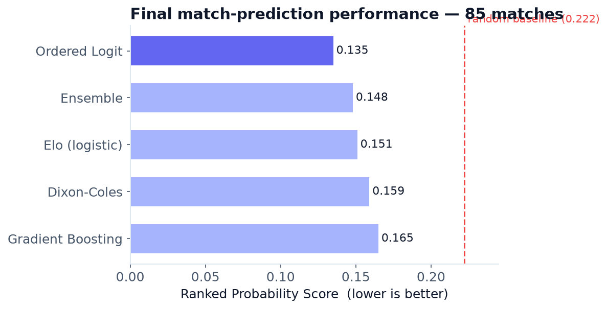
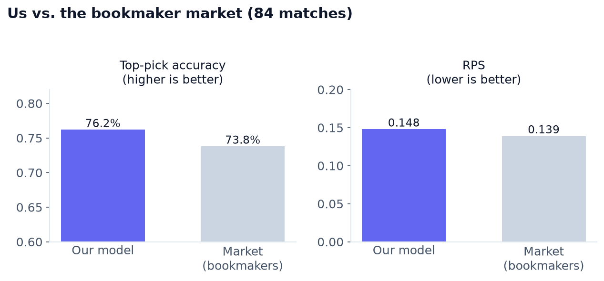
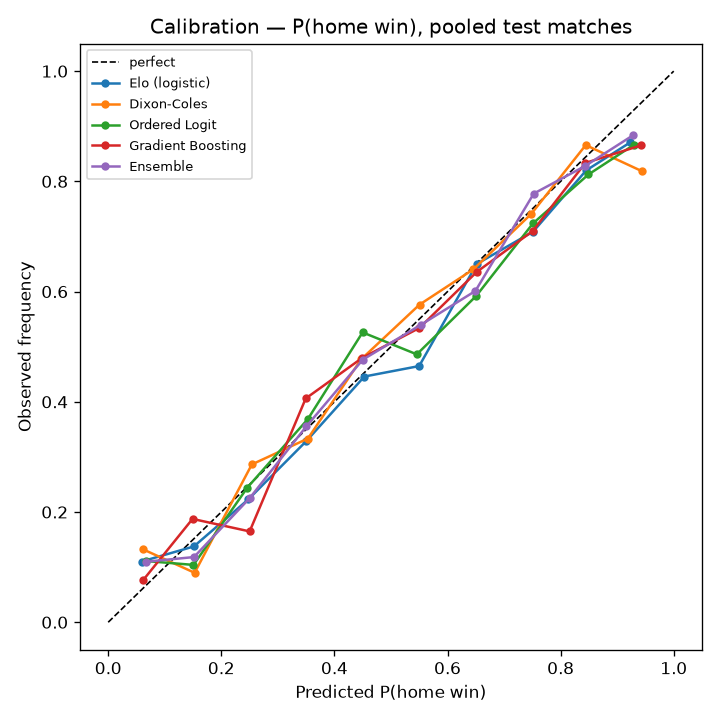

Over the 2026 World Cup I ran a model that predicted every match *before kickoff* — and by the final it was beating the bookmakers on accuracy. Here's the honest story of how it went.

Football is a brutal sport to predict. It's low-scoring, a single goal swings everything, and favourites get knocked out all the time. That randomness makes it easy to fool yourself: a model can look brilliant on a lucky weekend or terrible through sheer variance. So when I set out to forecast the 2026 World Cup, I cared about two things equally — building something genuinely predictive, *and* holding myself to a standard of evaluation that hindsight couldn't inflate.

The rule I made for myself was simple:

> Every prediction gets frozen to a timestamped file **before the match kicks off**, and is scored later against the result. No back-dating, no cherry-picking.

That one discipline is what makes the numbers below trustworthy.

## What I built

The system predicts the three-way outcome of a match — **home win / draw / away win** — as calibrated probabilities, not just a label. Under the hood it blends four different modelling philosophies:

- **Elo (logistic):** the classic rating system, turned into probabilities. The baseline everything else has to beat.
- **Dixon–Coles:** the textbook football model — goals as Poisson processes with per-team attack and defence strengths, plus a correction that fixes the usual under-prediction of draws.
- **Ordered logistic regression:** respects the natural ordering *away < draw < home*.
- **Gradient boosting:** trees over a pile of engineered features.

Each one is probability-**calibrated**, and they're combined into a weighted **ensemble**. Every feature — Elo, recent form, goals, rest days, confederation, home advantage — is computed *as of* each match date, so there's no information leakage from the future.

One feature I'm particularly happy with: **time-varying squad strength**. A national team is really just its *current players*, and squads turn over — "Brazil 2018" and "Brazil 2026" are different teams. So instead of a fixed country rating, I built a per-year squad-strength index from football-video-game player ratings (FIFA 15 through FC 26), attached to each match using the edition available *at the time*. 2018 games see the 2018 squad; the 2026 World Cup sees the current one.

The data is all free and public: ~49,000 international results since 1872, a live fixtures feed, an in-house Elo, and the player ratings. Nothing behind a paywall.

## The results

**I predicted 85 matches before kickoff across the tournament.** For reference, a model guessing randomly scores 33% accuracy and an RPS (the standard "how good were the probabilities" metric — lower is better) of 0.222.

| Model | Accuracy | RPS |
|---|---|---|
| **Ordered Logit** | **76.5%** | **0.135** |
| Ensemble | 76.5% | 0.148 |
| Elo (logistic) | 69.4% | 0.151 |
| Dixon–Coles | 71.8% | 0.159 |
| Gradient Boosting | 68.2% | 0.165 |

*Every model comfortably beat the random baseline. Ordered logistic regression was the quiet star.*

### Beating the market

The real test isn't the random baseline — it's the **bookmakers**. De-vigged closing odds are about the strongest public predictor that exists; almost no hobby model beats them. Over the 84 matches where I had pre-kickoff odds to compare against:

| | Accuracy | RPS |
|---|---|---|
| **My model** | **76.2%** | 0.148 |
| Market (bookmakers) | 73.8% | **0.139** |

**I edged the market on accuracy** — a couple more correct calls over the tournament — while the book stayed slightly sharper on probability calibration (that's the RPS gap). Matching, let alone beating, closing odds over a full World Cup is a result I did not take for granted.

### Calling the champion

The final was **Spain 1–0 Argentina**. My model picked **Spain** — a genuine coin-flip call (38% Spain / 32% draw / 30% Argentina), but the right one. And both finalists had been in my pre-tournament top two.

## The honest part: it started badly

I'm not going to pretend it was smooth. The **opening week was near-random**. Eight of the first sixteen games were draws, big favourites dropped points (Spain drew 0–0 with Cape Verde!), and my models were hovering right around the coin-flip line. If I'd judged the whole project on that first week, I'd have concluded it was worthless.

That's exactly why the honest evaluation mattered. Football's signal only shows up over a large sample. The group stage settled down (~73% accuracy), the knockouts held up, and it all compounded into the final numbers above. A well-calibrated 55% call really is worth more than a lucky label — you just have to wait for enough matches to prove it.

## A few things I learned

- **The ensemble wasn't automatically best.** A single well-chosen model — the ordered logit — matched or beat the equal-weight blend, because naïve averaging was being dragged down by the weakest member. Halfway through, I re-weighted the ensemble toward the models that were actually performing, and it improved.
- **I was consistently under-confident on favourites** compared to both the market and Opta's supercomputer. Adding squad strength narrowed that gap but didn't fully close it — the pros clearly encode player-level information that a results-only model only approximates.
- **Calibration matters as much as the model.** A light temperature-scaling step fixed the opening-week over-confidence without hurting the long run.

*Reliability of the home-win probability: the closer to the diagonal, the better the probabilities are calibrated.*

## Wrapping up

I set out to predict one of the most random sports there is, kept myself honest with frozen predictions and proper scoring rules, and came out **calling the champion and edging the bookmakers on accuracy**. The whole thing ran on free data and classic methods, glued together carefully.

If there's one takeaway beyond football: the hardest part of a forecasting project isn't the model — it's building an evaluation you can actually trust. Freeze your predictions, score them properly, and let the sample size do the talking.
